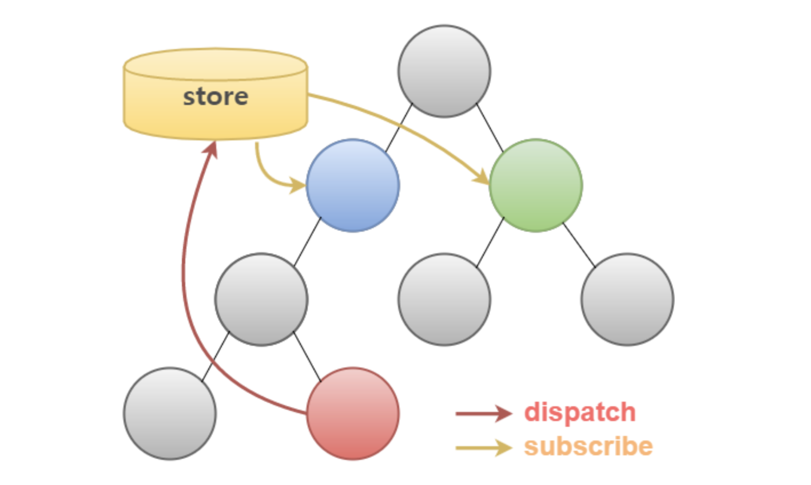

# REDUX

## FLUX 패턴

MVC 모델에서, Model 과 View 가 늘어난다면 그 둘 객체들 사이에 생기는 오류 및 수정사항에 대한 유지보수가 상당히 힘들어집니다. 그러한 문제를 해결하기 위해 먼저 FLUX 라는 디자인 패턴이 만들어졌습니다.
이는, 어떠한 Action 을 받았을 때, Dispatcher 가 받은 Action 들을 통제하여 Store 에 있는 상태 데이터를 업데이트하고 바뀐 데이터에 대해 View 로 Rendering 하게 됩니다.

## REDUX

#### REDUX 는 바로 이 FLUX 디자인 패턴을 좀 더 편하게 사용할수 있게 해주는 Library 입니다.

#### 아래와 같이, store 에서 모든 데이터를 담고 있고, 컴포넌트끼리는 직접 교류하지 않고 store 중간자를 통하여 교류합니다. 빨간 화살표는 dispatch 를 의미하며 store 에 있는 데이터를 업데이트 하는것을 가르키고, 주황색 화살표는 subscribe 를 의미하며, 해당 컴포넌트에서 store 에 있는 특정 데이터의 변동을 주의하고있다가 변동이 있을시 바로 반영시키는것을 가르킵니다.

### Reducer (리듀서)
Redux 에선 어플리케이션에서 state를 직접 변경하는것을 허용하지 않습니다 그 대신, action 을 dispatch 하여 state 값을 변경하게 됩니다.
#### 이 과정에서 action 객체를 처리하는 함수를 바로 Reducer 라고 부릅니다. action 이 어떤 변화가 일어날지 알려주는 역할을 한다면, Reducer는 그 정보를 받고 어플리케이션 상태를 바꾸도록 정의합니다.

#### Reducer의 가장 좋은 조건
* 외부 네트워크 혹은 DB에 접근하지 않아야 한다.
* return 값은 오직 parameter 값에만 의존 되어야 한다.
* 인수는 변경되지 않아야 한다.
* 같은 인수로 실행된 함수는 언제나 같은 결과를 반환해야 한다.
* 순수하지 않은 API 호출을 하지 말아야 한다. (Data(), Math() 등)
